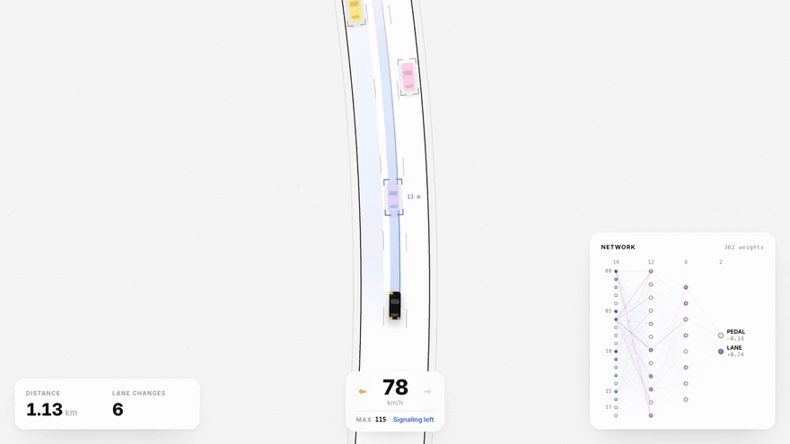
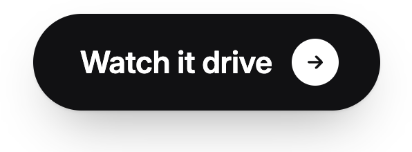
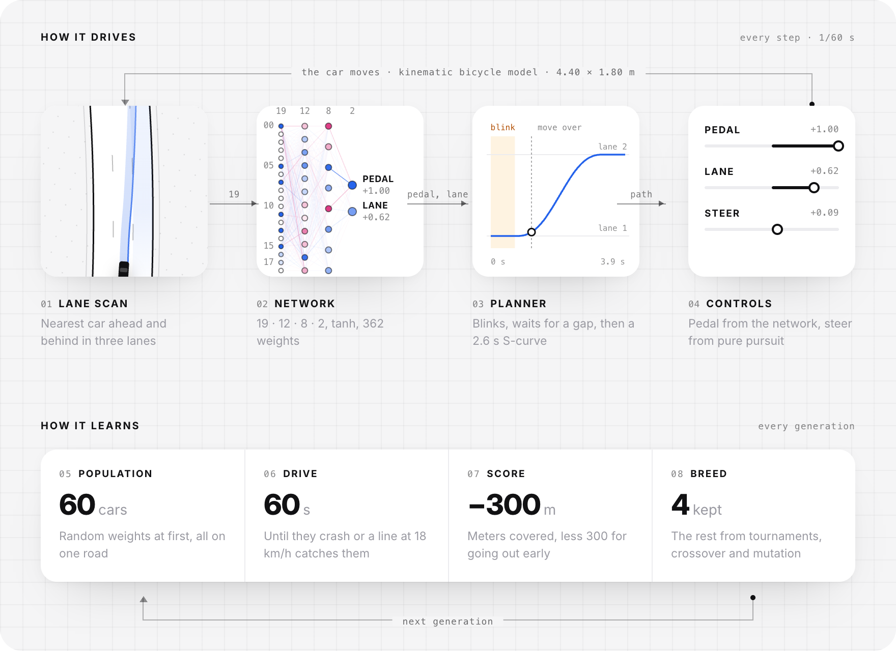
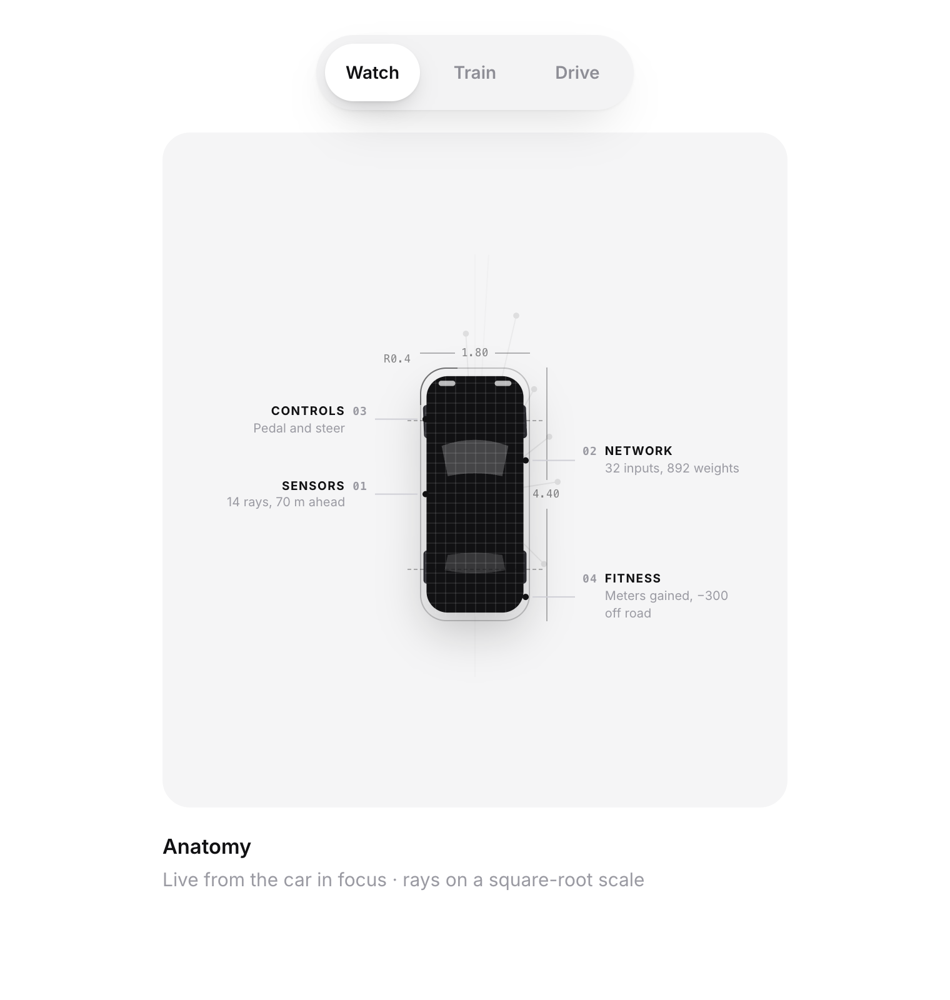
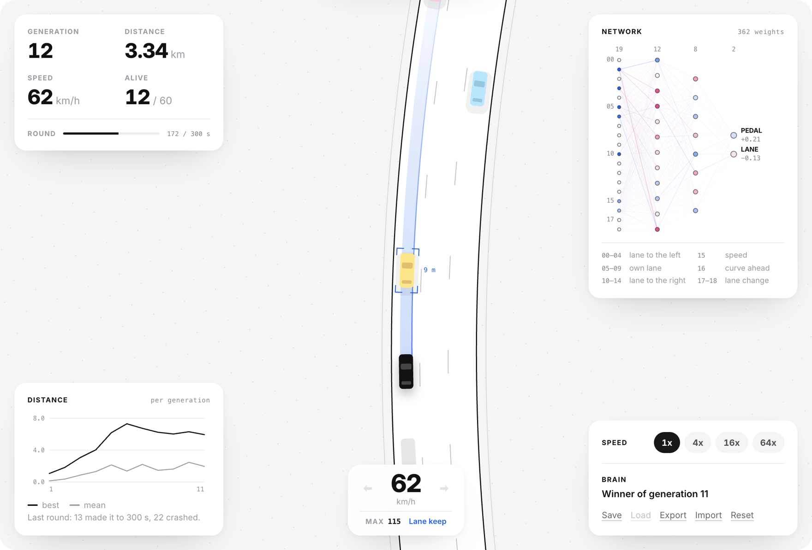

# self-driving-car

A small neural network that taught itself, by evolution, to drive a curvy three-lane highway through traffic: hold the lane, brake in time, and signal and overtake when the next lane is faster. Plain JavaScript.

<p align="center">
  <a href="https://stxqq.github.io/self-driving-car/"></a>
</p>

<p align="center">
  <a href="https://github.com/Stxqq/self-driving-car/actions/workflows/ci.yml"></a>
  <a href="https://stxqq.github.io/self-driving-car/"></a>
  <a href="LICENSE"></a>
  
  
</p>

<p align="center">
  <a href="https://stxqq.github.io/self-driving-car/">
    <picture>
      <source media="(prefers-color-scheme: dark)" srcset=".github/assets/launch-dark.png">
      
    </picture>
  </a>
  <a href="https://github.com/Stxqq/self-driving-car">
    <picture>
      <source media="(prefers-color-scheme: dark)" srcset=".github/assets/star-dark.png">
      
    </picture>
  </a>
  <br>
  <sub>If it made you smile, a star helps more people find it.</sub>
</p>

Nobody shows the network how to drive. Each generation, a population of
networks takes to the same stretch of road; the ones that get furthest
become the parents of the next. The page lets you watch the trained driver,
evolve your own from random weights in the browser, or take the wheel
yourself while the network shows what it would have done.

The driving is split the way a driver-assist system splits it. The network
decides the pedal and which lane it wants to be in. A planner turns "the
lane to the left" into a lane change: it blinks, waits for the gap, moves
over on a smooth S-curve and settles in the center of the new lane. The
blue ribbon on the page is that plan.

In Drive you take the network's place, with the same planner: the car
runs on cruise control from a set speed of 70 km/h, holding ↑ raises it,
↓ brakes (and the set speed follows you down), ← and → ask for a lane
change. The network card keeps showing what the trained brain would do.

There is no library underneath: the road, the car, the perception, the
planner, the traffic, the network and the genetic algorithm are about
1,300 lines of ES modules that run unchanged in the browser and in Node.

## How it works

<p align="center">
  
</p>

Every 1/60 s the car scans the lanes, the network turns 19 numbers into a
pedal and a lane, the planner turns the lane into steering, and the car
moves. The values in the diagram are one real moment from the shipped
brain, a fifth of the way into a lane change.

- **Road.** A seeded highway built from clothoids, so curvature ramps
  smoothly and there are no kinks to trip the steering. It is generated
  lazily as the car drives.
- **Car.** A kinematic bicycle model in SI units, tuned like a family
  hatchback: 4.4 m long, 0 to 100 km/h in 9.8 s, 115 km/h top speed, 8 m/s²
  of braking, and engine braking off the throttle. Steer asks for a share of the available cornering grip rather than
  a wheel angle, so the same output means the same sideways pull at 30 km/h
  and at 110 km/h. Take a 110 m bend at full speed and the grip runs out.
- **Perception.** Not raw pixels or rays but what a camera stack hands its
  planner: for the lane to the left, the car's own lane and the lane to the
  right, whether the lane exists, the nearest car ahead and behind (up to
  90 m and 45 m) and how fast each gap is closing. Plus speed, the sharpest
  curve in the next 100 m, and the planner's state. 19 inputs.
- **Network.** 19 · 12 · 8 · 2, tanh, 362 weights. Two outputs: the pedal,
  and the lane, where above +0.5 asks for the lane to the left and below
  −0.5 for the one to the right.
- **Planner.** Hand-written, not learned. On a request it blinks for 0.7 s,
  then moves over along a quintic S-curve (zero sideways speed and
  acceleration at both ends) in 2.6 s, and steers along it with pure
  pursuit about half a second ahead. Letting go of the request while it
  blinks calls the change off. The one decision it makes on its own: it
  won't start moving while a car in the target lane is level with it or
  about to be, the way blind-spot monitoring holds a lane change; it keeps
  blinking and goes when the gap opens. Everything else, including whether
  to change lanes at all and how hard to brake for a car that cuts in, is
  up to the network.
- **Traffic.** Background cars follow the Intelligent Driver Model, want
  speeds between 61 and 94 km/h with every lane mixing slow and fast,
  overtake on the left and move back right once past. They blink for 1.2 s
  before changing lanes. They treat the learning cars like any other car:
  keep their distance behind one, overtake a slow one on the left, and
  don't move into a lane where one is driving, blinking or moving over. A
  crash is therefore always the learning car's doing: it cut in too close,
  braked hard in front of someone, or ran into a car it was following.
  Because traffic reacts to the learning cars, the headless trainer drives
  every brain on its road alone, so a score never depends on who else was
  on the road. In Train mode in the page all 60 share one road.
- **Fitness.** Meters of road covered, minus 300 for crashing or for being
  caught by a line that sweeps up the road at 18 km/h, minus 4 m for every
  second spent in a left lane while the lane to its right is free (nobody
  within 15 m behind, the next car ahead at least 60 m off and no closer
  than the one in its own lane). Nothing rewards a lane change as such; the
  network overtakes because it covers more road, and moves back right
  because staying left costs a little.
- **Evolution.** Elitism (the best four carry over), tournament selection,
  BLX-0.25 blend crossover and gaussian mutation whose rate and size decay
  with a 40-generation half-life.

Before the planner the network steered directly from a fan of ray sensors.
It learned to hold a lane and to dodge, but it mostly sat in the fast lane
behind whoever was there. With the steering handed to a planner, the search
only has to find *when* and *where*, and overtaking became the thing that
separates a good driver from a safe one.

The simulation is deterministic down to the last bit: same seed, same
brains, same trajectories, and the same generations at 64x as at 1x (the
speed buttons only run more fixed 1/60 s steps per frame; a test checks it). (It avoids `**` in the physics for that reason;
V8 changed its `pow` between releases.) The test suite replays all 30
held-out runs and checks them to the meter.

<p align="center">
  
</p>

## Quickstart

```sh
git clone https://github.com/Stxqq/self-driving-car.git
cd self-driving-car
npm run serve          # python3 -m http.server 5101
```

Open <http://localhost:5101>. Any static server works; ES modules just don't
load from `file://`. Nothing to install, and `npm test` needs only Node 22 or
newer.

## Training from the command line

Training runs headless across worker threads. By default it writes to
`runs/brain.json`, so it never touches the shipped brain:

```console
$ node scripts/train.mjs --generations 10 --population 120 --seeds 3 --seconds 60
13 workers, population 120, 3 seeds x 60 s, traffic x1
 gen   best m   mean m  alive    mut     s
   0     1344      351     22  0.150   0.3
   1     1359      466     12  0.148   0.1
   2     1204      452     17  0.146   0.1
   ...
   7     1287      650     15  0.136   0.1
   8     1286      570     18  0.134   0.1
   9     1356      691     17  0.133   0.1
done in 0.0 min, best validation 1237 m
```

Even generation 0 has cars that drive a full minute, because the planner
keeps every one of them in its lane; the mean is what climbs. `--density`
scales the traffic and `--resume` starts from the brain at `--out` with
gentler mutation. The schedule behind the shipped brain is
`scripts/curriculum.sh`: two-minute episodes in full traffic, then
five-minute ones on more and more roads per generation, and last a
fine-tune with the keep-right penalty. The whole thing took about an hour
on a 14-core laptop.

To score a brain on roads it has never seen:

```console
$ node scripts/evaluate.mjs --seeds 9001,9002,9003,9004,9005
 seed   meters      s   km/h  lanes  ended
 9001     7504  300.0   90.0     35  time
 9002     6464  300.0   77.6     42  time
 9003     7223  300.0   86.7     27  time
 9004     6465  300.0   77.6     37  time
 9005     3737  174.4   77.2     26  crashed
mean 6279 m, median 6465 m, 4 of 5 still on the road at the end, 5.3 lane changes per km
```

Brains trained in the page can be exported as JSON and loaded back with
Import, or passed to `evaluate.mjs --brain`.

## Results

The shipped brain (`src/brains/pretrained.json`, 362 weights) on 30 seeds it
was never trained or validated on, five minutes each, full traffic:

| | before (rays, steering) | now (lane scan, planner) |
|---|---|---|
| Mean distance | 4.05 km | 6.90 km |
| Median distance | 4.66 km | 7.23 km |
| Still on the road after five minutes | 20 of 30 | 28 of 30 |
| Average speed | 56 km/h | 87 km/h |
| Lane changes | – | 5.1 per km |
| In a left lane with the right lane free | – | 22 s of every 5 min |
| Shortest run | 1.39 km | 0.64 km |

"Before" is the previous version of this project, a 32-20-10-2 network
steering straight from 14 ray sensors, on the old traffic. The traffic is
different now (every lane mixes slow and fast cars, and cars blink before
moving over), so the two columns are not the same exam; the old driver
mostly followed the fast lane, the new one changes lanes about every 200 m.

Every number comes from `npm run evaluate -- --write`, which writes
`scripts/results.json`; the page reads the same file. Traffic tops out at
94 km/h and the car at 115, so the average speed is what overtaking buys.
The two crashes both happen at full speed, running into slower traffic it
brakes for too late.

These numbers are with the current traffic and car, which now react to
the learning car and accelerate and brake like a real hatchback. The brain
was trained before those changes and re-evaluated after them; it does
slightly better than before (traffic no longer cuts in on it blind or runs
into it). A fine-tune on the new traffic scored higher on its eight
validation roads but worse on the held-out ones, six crashes instead of
two, so it was not kept.

Keeping right is learned, and only partly. Before the keep-right penalty
the network spent 29 s of every five minutes in a left lane with a free
lane beside it; after a fine-tune with the penalty, 17 s on the old
traffic and 22 s on the current one. It signals and moves back after most
overtakes; the rest of the time it holds the left lane through a gap it
judges too short to be worth two lane changes.

<p align="center">
  
</p>

## Project layout

```
src/sim/       road, car, perception, planner, traffic, world, brain, evolution (no DOM)
src/render/    canvas stage, network view, anatomy spec sheet, svg chart
src/ui/        the page: sessions for watch, train and drive, storage, keys
src/brains/    pretrained.json
scripts/       train.mjs, curriculum.sh, evaluate.mjs, results.json
test/          node:test suites, including the held-out replay
```

## Credits

- The idea of a small network driving a car in the browser, built from
  scratch, is the one Radu Mariescu-Istodor made popular with his
  JavaScript self-driving car course; this project started from his ray
  sensors. The split into perception, a learned decision and a planner
  that blinks and steers is the shape of production driver-assist systems
  such as Tesla Autopilot, not anything from their code.
- Steering is pure pursuit, from Coulter, *Implementation of the Pure
  Pursuit Path Tracking Algorithm* (CMU-RI-TR-92-01, 1992).
- Traffic uses the Intelligent Driver Model from Treiber, Hennecke and
  Helbing, *Congested traffic states in empirical observations and
  microscopic simulations* (Phys. Rev. E, 2000).
- The car is the kinematic bicycle model as described in Kong, Pfeiffer,
  Schildbach and Borrelli, *Kinematic and dynamic vehicle models for
  autonomous driving control design* (IEEE IV, 2015).
- Blend crossover is BLX-α from Eshelman and Schaffer, *Real-coded genetic
  algorithms and interval-schemata* (1993).
- The look follows my portfolio; type is Inter by Rasmus Andersson.

## License

MIT © 2026 Stefan Carapic
